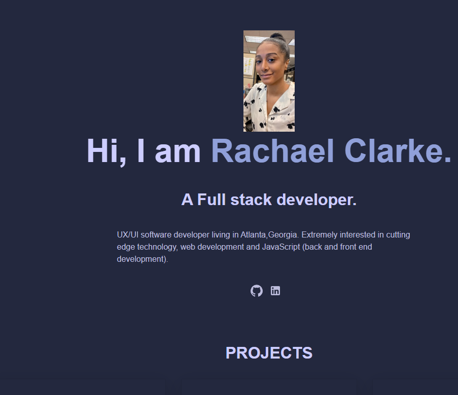

# myreactportfolio

## Description

I created a portfolio with React to showcase some of the projects I've been working on these past 6 months.It includes a small bio,a link to my linkedin,and a "contact" button to email me directly. There is also a "Skills" section showing what programming languages and database systems I am familiar with. Hopefully this portfolio shows where I stand so far as a UX/UI student!

## Link

https://rachaelsreactportfolio.netlify.app/

## Screenshot

